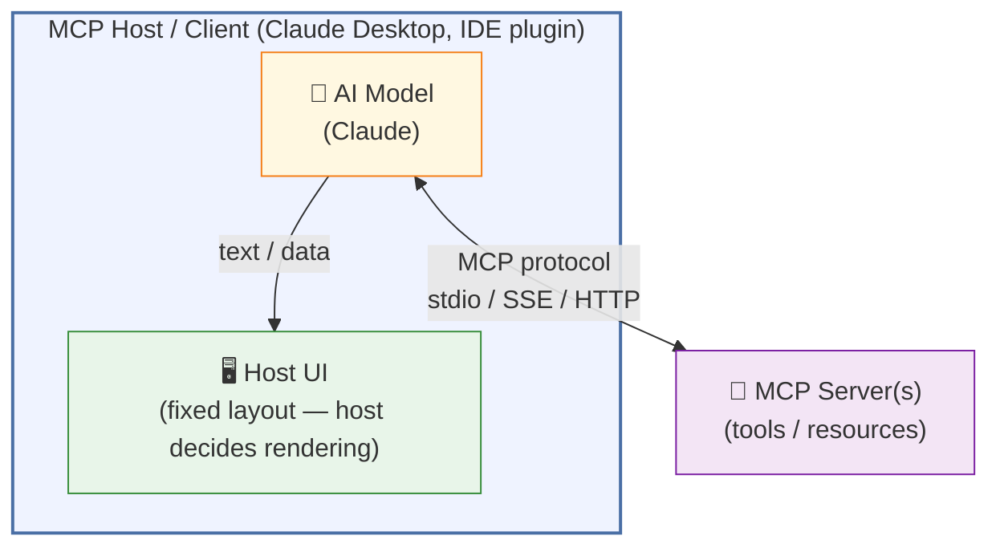
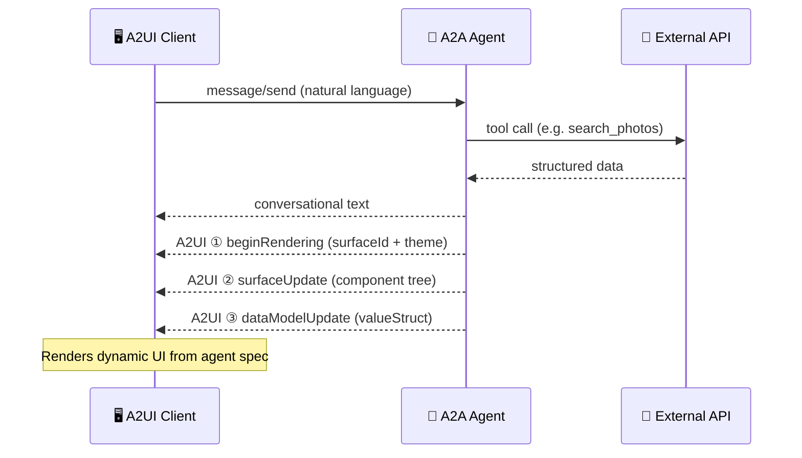
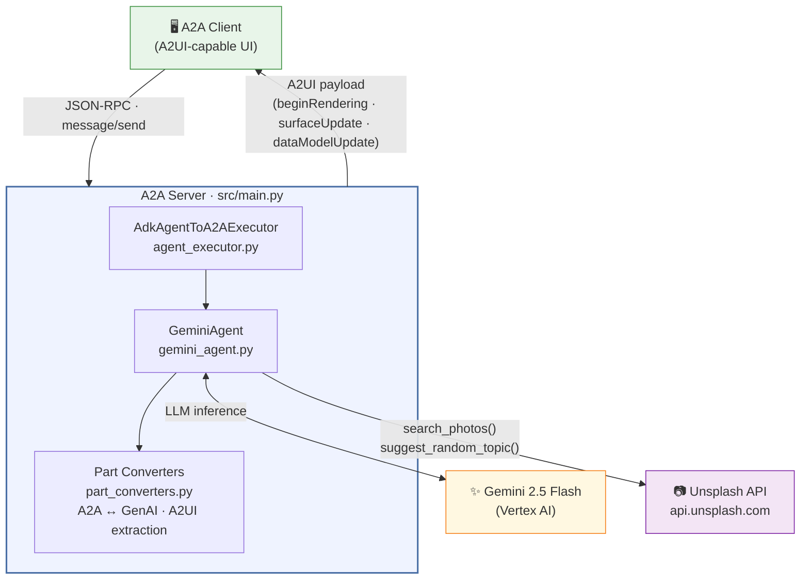
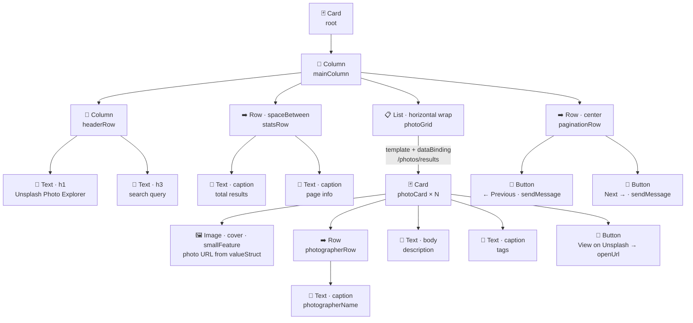

# A2UI Unsplash Photo Explorer

An enterprise-grade example of an **Agent-to-User Interface (A2UI)** agent built with [Google's Agent Development Kit (ADK)](https://google.github.io/adk-docs/) and Gemini 2.5 Flash. Users interact with the agent in natural language; the agent queries the [Unsplash API](https://unsplash.com/developers) and renders results as a dynamic, interactive photo gallery UI.

---

## MCP UI vs Agent-to-UI (A2UI)

Two patterns exist for agents that generate user interfaces. They solve different problems
and operate at different layers of the stack.

### MCP UI (Model Context Protocol)

[MCP](https://modelcontextprotocol.io) is Anthropic's open protocol for connecting AI
models to **tools, resources, and context**. It is host-centric: the MCP client (e.g.,
Claude Desktop, an IDE plugin) owns the UI entirely. The agent returns data or text; the
**host decides how to render it**.



**Key characteristics:**
- The host application controls layout, components, and rendering
- The agent has no say in what the UI looks like
- Great for tool augmentation inside an existing product (e.g., adding search to an IDE)
- UI is tied to one host; not portable across clients

---

### A2UI (Agent-to-User Interface)

A2UI is a protocol where the **agent itself defines and sends the UI**. The agent
constructs a full component tree — cards, grids, images, buttons, lists — and transmits
it alongside its conversational response. Any A2UI-capable client renders exactly what
the agent specified, regardless of which AI model or host is in use.



**Key characteristics:**
- The agent owns UI layout, component types, theming, and data binding
- UI is described in a portable JSON schema — any compliant client renders it identically
- Data and structure are decoupled: `surfaceUpdate` defines the component tree once;
  `dataModelUpdate` pushes new data without re-sending the component tree
- Works over the A2A protocol (agent-to-agent transport), making it model-agnostic
- Enables rich, domain-specific UIs (galleries, dashboards, forms) from pure agent output

---

### Side-by-side comparison

| | **MCP UI** | **A2UI** |
|--|-----------|---------|
| **Who owns the UI** | Host / client application | The agent |
| **UI portability** | Tied to one host | Any A2UI-capable client |
| **UI definition** | Fixed by the host at build time | Sent dynamically per response |
| **Data + layout coupling** | N/A (host manages both) | Decoupled via `valueStruct` |
| **Transport** | MCP (stdio / SSE / HTTP) | A2A (JSON-RPC over HTTP) |
| **Model dependency** | Anthropic / Claude-specific | Model-agnostic |
| **Best for** | Augmenting an existing product's UI | Agents that need custom UI output |
| **Component schema** | None (host defines components) | Full schema: Card, Row, Column, List, Image, Button, … |
| **Theming** | Host-controlled | Agent-controlled (`primaryColor`, `font`) |
| **Interactivity** | Via host-defined actions | Via `sendMessage` / `openUrl` button actions |

### When to choose each

- **Use MCP UI** when you are building tools for an existing host that already has a UI
  (e.g., adding a database query tool to Claude Desktop or a code search tool to a JetBrains plugin).

- **Use A2UI** when the agent itself is the product and needs to render structured,
  domain-specific UI — such as photo galleries, weather dashboards, search results, or
  data visualisations — across multiple clients without rebuilding the UI in each one.

This project uses **A2UI** because the photo gallery layout, dynamic theming, and
pagination controls are agent-domain concerns, not host-application concerns.

---

## Architecture



### Module Responsibilities

| File | Responsibility |
|------|---------------|
| `main.py` | ASGI entrypoint — initializes agent, builds A2A application |
| `gemini_agent.py` | Agent class, Unsplash tool definitions, agent card |
| `prompt_builder.py` | System prompt, A2UI photo gallery template, theming rules |
| `a2ui_schema.py` | A2UI JSON Schema — defines all valid component structures |
| `part_converters.py` | Stable A2A ↔ GenAI type conversions, A2UI payload extraction |
| `agent_executor.py` | ADK-to-A2A execution bridge with session management |

---

## Tech Stack

- **AI**: [Google ADK](https://google.github.io/adk-docs/) + Gemini 2.5 Flash
- **Agent Protocol**: [A2A (Agent-to-Agent)](https://a2aproject.github.io/A2A/) v0.3
- **UI Protocol**: A2UI (Agent-to-User Interface)
- **Web Framework**: FastAPI / Starlette / Uvicorn
- **Photos API**: [Unsplash API](https://unsplash.com/documentation)
- **HTTP Client**: [HTTPX](https://www.python-httpx.org/)
- **Config**: python-dotenv (12-factor app pattern)

---

## Prerequisites

- Python 3.11+
- A Google Cloud project with Vertex AI API enabled
- An [Unsplash developer account](https://unsplash.com/developers) with an app registered

---

## Setup

### 1. Clone and enter the project

```bash
git clone https://github.com/arananet/a2ui-example.git
cd a2ui-example/src
```

### 2. Create and activate a virtual environment

```bash
python3 -m venv .venv
source .venv/bin/activate  # On Windows: .venv\Scripts\activate
```

### 3. Install dependencies

```bash
pip install -r requirements.txt
```

### 4. Configure environment variables

```bash
cp .env.example .env
```

Then edit `.env` with your real credentials:

```env
# Google ADK / Gemini
# Option A — Google AI Studio (simplest, free tier available)
# Get your key at: https://aistudio.google.com/app/apikey
GOOGLE_API_KEY=your-google-api-key-here

# Option B — Vertex AI (production / enterprise)
# Required only if NOT using GOOGLE_API_KEY
# GOOGLE_CLOUD_PROJECT=your-gcp-project-id
# GOOGLE_CLOUD_LOCATION=us-central1

MODEL=gemini-2.5-flash
AGENT_URL=http://127.0.0.1:8001

# Unsplash API
UNSPLASH_ACCESS_KEY=your_unsplash_access_key_here
```

> **Security**: `.env` is gitignored and must never be committed. Only `.env.example` (with placeholder values) is tracked in version control.

### 5. Authenticate with Google Cloud

```bash
gcloud auth application-default login
gcloud config set project YOUR_PROJECT_ID
```

---

## Running the Agent

```bash
cd src
uvicorn main:app --reload --port 8001
```

The server starts at `http://localhost:8001`.

---

## Verifying the Agent

### Check the Agent Card

```bash
curl http://localhost:8001/.well-known/agent-card.json | python3 -m json.tool
```

### Send a photo search request

Uses the A2A v0.3 `message/send` method:

```bash
curl -X POST http://localhost:8001/ \
  -H "Content-Type: application/json" \
  -d '{
    "jsonrpc": "2.0",
    "id": "1",
    "method": "message/send",
    "params": {
      "message": {
        "role": "user",
        "parts": [{"kind": "text", "text": "Find me photos of misty mountain peaks"}],
        "messageId": "msg-001"
      }
    }
  }'
```

### Try a random topic suggestion

```bash
curl -X POST http://localhost:8001/ \
  -H "Content-Type: application/json" \
  -d '{
    "jsonrpc": "2.0",
    "id": "2",
    "method": "message/send",
    "params": {
      "message": {
        "role": "user",
        "parts": [{"kind": "text", "text": "Surprise me with something beautiful"}],
        "messageId": "msg-002"
      }
    }
  }'
```

### Stream a response

Uses the A2A v0.3 `message/stream` method:

```bash
curl -X POST http://localhost:8001/ \
  -H "Content-Type: application/json" \
  -d '{
    "jsonrpc": "2.0",
    "id": "3",
    "method": "message/stream",
    "params": {
      "message": {
        "role": "user",
        "parts": [{"kind": "text", "text": "Find me urban architecture photos"}],
        "messageId": "msg-003"
      }
    }
  }'
```

### Verify no secrets are in source

```bash
grep -r "Client-ID\|UNSPLASH_ACCESS_KEY=" src/*.py  # Should return nothing
```

---

## A2UI Photo Gallery Component Tree

The agent constructs this component hierarchy for every photo search response:



---

## Dynamic Theming

The agent selects a primary color based on the search topic:

| Topic Category | Color | Hex |
|----------------|-------|-----|
| Nature / Landscape / Forest | Teal | `#00897B` |
| Architecture / City / Urban | Indigo | `#3949AB` |
| Food / Drink / Cuisine | Amber | `#F57C00` |
| Art / Abstract / Creative | Purple | `#8E24AA` |
| Sport / Fitness / Action | Red | `#E53935` |
| People / Portrait / Culture | Blue Grey | `#546E7A` |
| Travel / Road / Journey | Teal | `#00897B` |
| Technology / Minimal | Cyan | `#00838F` |
| Default | Deep Blue | `#1565C0` |

---

## Agent Skills

| Skill | Example Prompts |
|-------|----------------|
| **Photo Search** | "Find me photos of Tokyo at night" |
| **Pagination** | "Show me page 2 of ocean photos" |
| **Random Topic** | "Surprise me", "Inspire me", "Something random" |
| **Orientation** | "Show portrait photos of people in markets" |

---

## Deploying to Railway

[Railway](https://railway.app) is the recommended deployment target. The repo includes
all required configuration files.

### 1. Create a GCP Service Account

Railway cannot use `gcloud auth`. Create a service account key for production:

```bash
# Create the service account
gcloud iam service-accounts create a2ui-photo-explorer \
  --project YOUR_PROJECT_ID \
  --display-name="A2UI Photo Explorer"

# Grant Vertex AI access
gcloud projects add-iam-policy-binding YOUR_PROJECT_ID \
  --member="serviceAccount:a2ui-photo-explorer@YOUR_PROJECT_ID.iam.gserviceaccount.com" \
  --role="roles/aiplatform.user"

# Export the key (keep this file secret — never commit it)
gcloud iam service-accounts keys create sa-key.json \
  --iam-account=a2ui-photo-explorer@YOUR_PROJECT_ID.iam.gserviceaccount.com
```

### 2. Deploy to Railway

```bash
# Install Railway CLI
npm install -g @railway/cli

# Login and initialise
railway login
railway init        # link to a new or existing project
railway up          # deploy
```

Or connect via the Railway dashboard → **New Project → Deploy from GitHub repo**.

### 3. Set Environment Variables

In the Railway dashboard go to your service → **Variables** and add every row below.
All values are required unless marked optional.

#### Google Cloud / Gemini

Choose **one** authentication method. Option A is the fastest way to get started.

**Option A — Google AI Studio API Key** *(recommended for getting started)*

| Variable | Value | Notes |
|----------|-------|-------|
| `GOOGLE_API_KEY` | *(your API key)* | Get it free at [aistudio.google.com/app/apikey](https://aistudio.google.com/app/apikey) |
| `MODEL` | `gemini-2.5-flash` | Gemini model ID (optional, this is the default) |

**Option B — Vertex AI / Service Account** *(production / enterprise)*

| Variable | Value | Notes |
|----------|-------|-------|
| `GOOGLE_CLOUD_PROJECT` | `your-gcp-project-id` | GCP project with Vertex AI enabled |
| `GOOGLE_CLOUD_LOCATION` | `us-central1` | Vertex AI region |
| `GOOGLE_APPLICATION_CREDENTIALS_JSON` | *(full contents of `sa-key.json`)* | Paste the entire JSON as one line — see step 1 |
| `MODEL` | `gemini-2.5-flash` | Gemini model ID (optional, this is the default) |

#### Agent

| Variable | Value | Notes |
|----------|-------|-------|
| `AGENT_URL` | `https://yourapp.up.railway.app` | Set **after** the first deploy; redeploy once updated |

#### Unsplash API
All three values are in your Unsplash developer dashboard under **Applications → your app**.

| Variable | Value | Notes |
|----------|-------|-------|
| `UNSPLASH_ACCESS_KEY` | *(Access Key from dashboard)* | Sent as `Authorization: Client-ID <key>` on every request |
| `UNSPLASH_SECRET_KEY` | *(Secret Key from dashboard)* | Required for OAuth user-level actions; stored for completeness |
| `UNSPLASH_APP_ID` | *(App ID number from dashboard)* | Numeric identifier; not sent in requests |

> **`PORT`** is injected automatically by Railway — do **not** set it manually.

### 4. Update AGENT_URL

After the first deploy, Railway assigns a public URL (e.g. `https://yourapp.up.railway.app`).
Update the `AGENT_URL` variable in Railway to this URL and redeploy.

### 5. Verify

```bash
# Check the agent card (A2A v0.3 manifest)
curl https://yourapp.up.railway.app/.well-known/agent-card.json | python3 -m json.tool

# Send a test message (A2A v0.3 message/send)
curl -X POST https://yourapp.up.railway.app/ \
  -H "Content-Type: application/json" \
  -d '{"jsonrpc":"2.0","id":"1","method":"message/send","params":{"message":{"role":"user","parts":[{"kind":"text","text":"Find photos of mountain lakes"}],"messageId":"test-001"}}}'
```

### Deployment File Reference

| File | Purpose |
|------|---------|
| `railway.toml` | Railway build/deploy config (repo root) |
| `Procfile` | Start command when root dir is the repo root |
| `requirements.txt` | Root-level pip requirements (forwards to `src/`) |
| `src/Procfile` | Start command when Railway root dir = `src/` |
| `src/nixpacks.toml` | Nixpacks build phases (Python 3.11, pip install) |

---

## Unsplash Attribution

Per the [Unsplash API Guidelines](https://help.unsplash.com/en/articles/2511245-unsplash-api-guidelines), all photos must attribute the photographer. This agent includes photographer name and profile link in every photo card rendered via A2UI.

Photos are provided by the [Unsplash](https://unsplash.com) community of photographers.

---

## License

Apache 2.0 — see [LICENSE](LICENSE).

---

## Developer

**Eduardo Arana**
